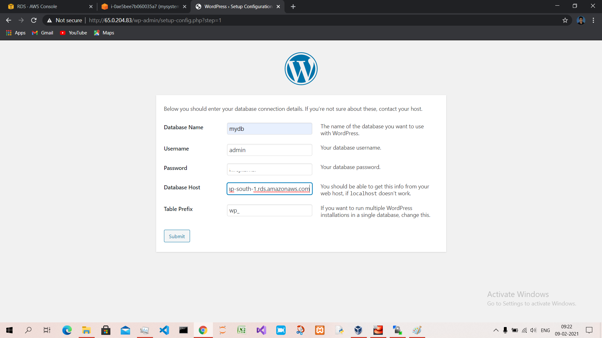

# AWS-RDS-service-with-WordPress 

Task Description📄

🔅 Create an AWS EC2 instance

🔅 Configure the instance with Apache Webserver.

🔅 Download php application name "WordPress".

🔅 As wordpress stores data at the backend in MySQL Database server. Therefore, you need to setup a MySQL server using AWS RDS service using Free Tier.

🔅 Provide the endpoint/connection string to the WordPress application to make it work. 

**AWS EC2 Instance Creataion**  

**Installation of httpd server and other software**  

**Creation of AWS RDS database Instance**  

